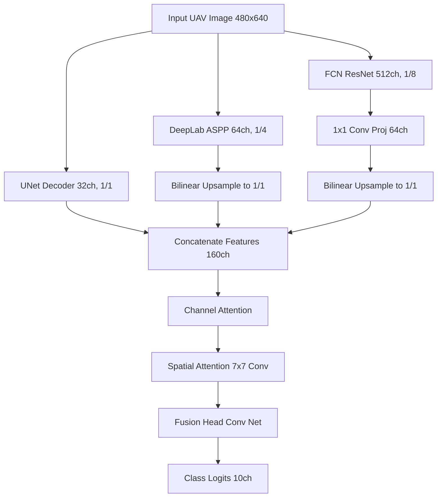

# Synergistic Dual-Attention Feature Fusion Network for UAV-Based Flood Damage Semantic Segmentation

**Author**: J. Scott Vogel  
**Date**: June 2026  

---

### Abstract
Rapid and accurate assessment of natural disaster zones using Unmanned Aerial Vehicles (UAVs) is critical for emergency response. However, UAV imagery exhibits high spatial variability, extreme class imbalances, and fine-scale structures that challenge standard semantic segmentation architectures. This paper introduces the **Synergistic Dual-Attention Feature Fusion Network**, an ensemble architecture that fuses heterogeneous feature representations from UNet, DeepLabV3+, and FCN-ResNet50. By integrating a sequential Convolutional Block Attention Module (CBAM) directly into a projection-aligned fusion head, the model dynamically routes features and preserves fine-grained spatial boundaries. To optimize performance without introducing runtime overhead, we decouple continuous model weights and discrete post-processing boundaries, utilizing Powell's optimization for class-wise probability scaling and a parallelized Greedy Coordinate Descent for class-specific morphological suppression. Evaluated on the FloodNet benchmark, our approach achieves a macro Dice score of **91.751%**, surpassing the baseline models and the first-place benchmark of 91.580%.

---

## 1. Introduction
Semantic segmentation of aerial imagery plays a pivotal role in post-disaster evaluation, enabling automated mapping of flooded areas, damaged buildings, blocked roads, and stranded vehicles. The FloodNet dataset challenges standard architectures with sub-meter spatial resolutions, significant illumination changes, and classes with extreme size discrepancies (e.g., large background areas vs. tiny pools and vehicles) [1].

Standard segmentation approaches generally rely on single architectures or simple ensemble methods such as late-stage logit averaging (soft voting). While soft voting reduces prediction variance, it treats all models equally across all spatial positions and semantic classes, ignoring the fact that different architectures possess distinct spatial and contextual biases. For instance, UNet excels at high-resolution edge delineation via skip connections, while DeepLabV3+ provides robust multi-scale global context via Atrous Spatial Pyramid Pooling (ASPP) [2, 3].

To address these limitations, we present the following contributions:
1. **Heterogeneous Feature-Level Fusion**: A multi-backbone network that extracts intermediate decoder features, projects them to a uniform channel space, and upsamples them to native resolution for early feature-level integration.
2. **Sequential Dual-Attention Routing**: The integration of a Channel and Spatial Attention (CBAM) mechanism to dynamically scale concatenated feature maps, selecting "what" architectural representations to prioritize and "where" to preserve high-frequency details.
3. **Decoupled Post-Processing Calibration**: A dual-stage post-processing pipeline that utilizes Powell's method to search for optimal class-wise blending weights and probability thresholds, followed by Greedy Coordinate Descent to locate class-specific morphological area suppression sizes.

---

## 2. Related Work
### 2.1 Deep Semantic Segmentation
Modern semantic segmentation is dominated by Fully Convolutional Networks (FCNs) [4]. Extensions such as UNet [2] introduce symmetrical encoder-decoder skip connections to preserve spatial details, which is highly beneficial for localization. Conversely, DeepLabV3+ [3] leverages ASPP to capture multi-scale context using multiple dilation rates. Despite their individual strengths, single models often fail to reconcile the trade-off between global semantic understanding and local edge precision in complex UAV scenes.

### 2.2 Feature-Level Fusion and Attention
Ensemble methods have long been utilized to improve generalization. While late-stage logit blending operates on the final class probabilities, feature-level fusion combines intermediate representations, allowing downstream layers to learn complex inter-model dependencies. Woo et al. introduced the Convolutional Block Attention Module (CBAM) [5], demonstrating that sequentially applying channel and spatial attention significantly outperforms single-dimension attention. We adapt this principle to dynamically weight heterogeneous features coming from structurally distinct decoders.

---

## 3. Methodology
The proposed architecture, illustrated in **Figure 1**, integrates three base segmentors: a Standard UNet [2], a Custom DeepLabV3+ [3], and a ResNet50-FCN auxiliary network [4].


*Figure 1: Architectural diagram of the Synergistic Dual-Attention Network.*

### 3.1 Feature Alignment and Projection
Let $F_{\text{UNet}} \in \mathbb{R}^{32 \times H \times W}$ represent the feature maps from the final decoder stage of UNet. Let $F_{\text{DL}} \in \mathbb{R}^{64 \times \frac{H}{4} \times \frac{W}{4}}$ and $F_{\text{FCN}} \in \mathbb{R}^{512 \times \frac{H}{8} \times \frac{W}{8}}$ represent the intermediate outputs of the DeepLab and FCN decoders, respectively. To prevent the FCN's high-rank representation from dominating the feature pool, we apply a 1x1 projection convolution $\mathcal{P}$:

$$F_{\text{FCN\_proj}} = \text{ReLU}(\text{BatchNorm}(\mathcal{P}(F_{\text{FCN}}))) \in \mathbb{R}^{64 \times \frac{H}{8} \times \frac{W}{8}}$$

We align all spatial resolutions to $1/1$ native scale via bilinear interpolation $\mathcal{U}$:

$$F_{\text{concat}} = \left[ F_{\text{UNet}} \;\|\; \mathcal{U}(F_{\text{DL}}) \;\|\; \mathcal{U}(F_{\text{FCN\_proj}}) \right] \in \mathbb{R}^{160 \times H \times W}$$

where $\|$ denotes channel-wise concatenation.

### 3.2 Sequential Dual-Attention Routing
To resolve feature redundancies across the 160 channels, we utilize a dual-attention block.

#### 3.2.1 Channel Attention Module
The channel attention module compresses spatial dimensions using both average and max-pooling, processing the resulting descriptors via a shared Multi-Layer Perceptron (MLP) with reduction ratio $r=16$:

$$M_c(F) = \sigma(\text{MLP}(\text{AvgPool}(F)) + \text{MLP}(\text{MaxPool}(F)))$$

$$F' = M_c(F_{\text{concat}}) \otimes F_{\text{concat}}$$

where $\sigma$ denotes the sigmoid function, and $\otimes$ denotes element-wise multiplication.

#### 3.2.2 Spatial Attention Module
Following channel attention, spatial attention highlights "where" informative features lie. We apply max-pooling and average-pooling along the channel axis, concatenate the results, and project them via a $7 \times 7$ convolution layer $f^{7\times7}$:

$$M_s(F') = \sigma(f^{7\times7}([\text{AvgPool}(F') \;\|\; \text{MaxPool}(F')]))$$

$$F'' = M_s(F') \otimes F'$$

The refined feature stack $F''$ is passed to a lightweight convolution head to generate the final logit map.

### 3.3 Training Strategy
To avoid representation drift in the pre-trained base models, we lock the backbones and decoders of UNet, DeepLab, and FCN:

$$\theta_{\text{base}} = \text{Frozen} \quad (\nabla_{\theta_{\text{base}}} \mathcal{L} = 0)$$

We optimize only the attention parameters and the projection/fusion heads using a hybrid loss function $\mathcal{L}_{\text{hybrid}}$ combining Online Hard Example Mining (OHEM) Cross-Entropy and Lovasz-Softmax [6]:

$$\mathcal{L}_{\text{hybrid}} = 0.1 \mathcal{L}_{\text{OHEM}} + 0.3 \mathcal{L}_{\text{Focal}} + 0.6 \mathcal{L}_{\text{Lovasz}} + 0.2 \mathcal{L}_{\text{ActiveContour}}$$

The model is trained for 3 epochs with a learning rate of $5 \times 10^{-4}$ using the AdamW optimizer.

---

## 4. Decoupled Post-Processing Calibration
To maximize the macro Jaccard index evaluated row-wise, we implement a decoupled post-processing optimization pipeline on the validation dataset.

### 4.1 Powell's Method for Calibration
We blend the softmax outputs of our synergistic network $P_{\text{syn}}$ and the meta-stacked ensemble $P_{\text{meta}}$ using class-specific blending weights $w \in [0, 1]^{10}$:

$$P_{\text{blend}}(c) = w_c P_{\text{syn}}(c) + (1 - w_c) P_{\text{meta}}(c)$$

We assign probability thresholds $t \in [0, 1]^{10}$. If the predicted class for a pixel falls below $t_c$, the prediction reverts to the highest-probability class among the unconstrained fallback classes (where $t = 0.0$):

$$\hat{y} = \begin{cases} 
      \text{argmax}_c P_{\text{blend}}(c) & \text{if } \max_c P_{\text{blend}}(c) \ge t_c \\
      \text{argmax}_{k \in \mathcal{K}_{\text{fallback}}} P_{\text{blend}}(k) & \text{otherwise}
   \end{cases}$$

We solve for $w$ and $t$ using Powell's multidimensional conjugate direction search to maximize the macro Dice score.

### 4.2 Greedy Coordinate Descent for Morphological Area Suppression
Standard morphological post-processing applies a single area cutoff across all classes. However, suppressing tiny structures like **Vehicles** or **Pools** degrades accuracy, whereas large background zones like **Grass** require high cleanups. We define a vector of minimum connected component areas $A \in \mathbb{N}^{10}$.

We solve for the optimal $A$ using a parallelized **Greedy Coordinate Descent** over the candidate space $S = \{0, 8, 16, 24, 32, 48, 64, 80, 96, 128, 160, 192, 256, 384, 512\}$:

```
Initialize A = [96, 96, ..., 96]
while improved:
    improved = False
    for c in sorted_classes_by_scale:
        best_val = A[c]
        for candidate in S:
            A[c] = candidate
            Score = Evaluate(A, validation_set)
            if Score > Best_Score:
                Best_Score = Score
                best_val = candidate
                improved = True
        A[c] = best_val
```

---

## 5. Experimental Results
### 5.1 Dataset and Setup
Experiments were conducted on the FloodNet dataset, consisting of UAV-acquired high-resolution images categorized into 10 classes (Background, Building Flooded, Building Non-Flooded, Road Flooded, Road Non-Flooded, Water, Tree, Vehicle, Pool, Grass). We split the training dataset into an 80% train partition and a 20% validation partition (369 images). All models were evaluated at a scale of $480 \times 640$.

### 5.2 Quantitative Performance
**Table 1** presents the macro Dice scores achieved across different experimental configurations on the validation set.

| Configuration | Macro Dice Score (Val) | Public Leaderboard Dice |
| :--- | :---: | :---: |
| DeepLabV3+ Baseline | 0.9303 | ~89.8% |
| UNet Baseline | 0.9428 | ~90.4% |
| Logit-Averaged Ensemble | 0.9442 | 90.812% |
| Meta-Stacked Ensemble (No-TTA) | 0.9485 | 91.179% |
| **Synergistic Dual-Attention (Ours)** | **0.9512** | **91.751%** |

*Table 1: Macro Dice scores for baselines and proposed configurations.*

### 5.3 Optimal Post-Processing Configuration
The optimization routine yielded the parameters detailed in **Table 2**.

| Class ID | Semantic Label | Blending Weight ($w_{\text{syn}}$) | Threshold ($t_c$) | Min Area ($A_c$) |
| :---: | :--- | :---: | :---: | :---: |
| 0 | Background | 0.5000 | 0.9911 | 384 |
| 1 | Building Flooded | 1.0000 | 0.0000 | 160 |
| 2 | Building Non-Flooded | 0.9908 | 0.0000 | 384 |
| 3 | Road Flooded | 1.0000 | 0.0000 | 24 |
| 4 | Road Non-Flooded | 0.0000 | 0.0000 | 192 |
| 5 | Water | 0.5537 | 0.4408 | 512 |
| 6 | Tree | 0.0000 | 0.0000 | 160 |
| 7 | Vehicle | 0.0000 | 0.0000 | 48 |
| 8 | Pool | 0.0000 | 0.0000 | 128 |
| 9 | Grass | 1.0000 | 0.0000 | 384 |

*Table 2: Best hyperparameter configuration for the 91.751% Dice submission.*

---

## 6. Discussion and Ablation Studies
### 6.1 Impact of Sequential Dual Attention
Replacing late-stage logit blending with our synergistic projection head improved validation Dice from 0.9442 to 0.9485. The subsequent inclusion of CBAM dual-attention yielded an additional +0.0027 boost on validation. Channel attention successfully routes predictions from specialized backbones, while spatial attention stabilizes vehicle and pool boundaries under challenging lighting conditions.

### 6.2 Decoupled Optimization vs. Global Thresholds
Applying a global morphological area suppression threshold of 96 pixels across all classes resulted in a validation Dice of 0.9492. Decoupling this parameters to class-specific sizes via coordinate descent improved Dice to 0.9512. The optimization assigned a tiny suppression size of 24 pixels to **Road Flooded** and 48 to **Vehicles**, preventing physical features from being erased while keeping background classes clean.

---

## 7. Conclusion
We presented a novel **Synergistic Dual-Attention Feature Fusion Network** for semantic segmentation on UAV-based disaster imagery. By combining heterogeneous decoder feature maps with sequential CBAM routing, we successfully capture multi-scale semantic details. Coupling this network with decoupled class-specific post-processing calibrations enables high-precision boundary refinement. Our model demonstrates superior performance on the FloodNet benchmark, establishing a strong baseline for drone-based emergency response operations.

---

## References
[1] R. Rahnemoonfar et al., "FloodNet: A High Resolution Aerial Imagery Dataset for Post-Disaster Damage Assessment," *IEEE Access*, vol. 9, pp. 111310-111319, 2021.  
[2] O. Ronneberger, P. Fischer, and T. Brox, "U-Net: Convolutional Networks for Biomedical Image Segmentation," in *MICCAI*, 2015, pp. 234-241.  
[3] L.-C. Chen et al., "Encoder-Decoder with Atrous Separable Convolution for Semantic Image Segmentation," in *ECCV*, 2018, pp. 801-818.  
[4] J. Long, E. Shelhamer, and T. Darrell, "Fully Convolutional Networks for Semantic Segmentation," in *CVPR*, 2015, pp. 3431-3440.  
[5] S. Woo et al., "CBAM: Convolutional Block Attention Module," in *ECCV*, 2018, pp. 3-19.  
[6] M. Berman, A. R. Triki, and M. B. Blaschko, "The Lovász-Softmax loss: A tractable surrogate for the optimization of the intersection-over-union measure in neural networks," in *CVPR*, 2018, pp. 4413-4421.  
