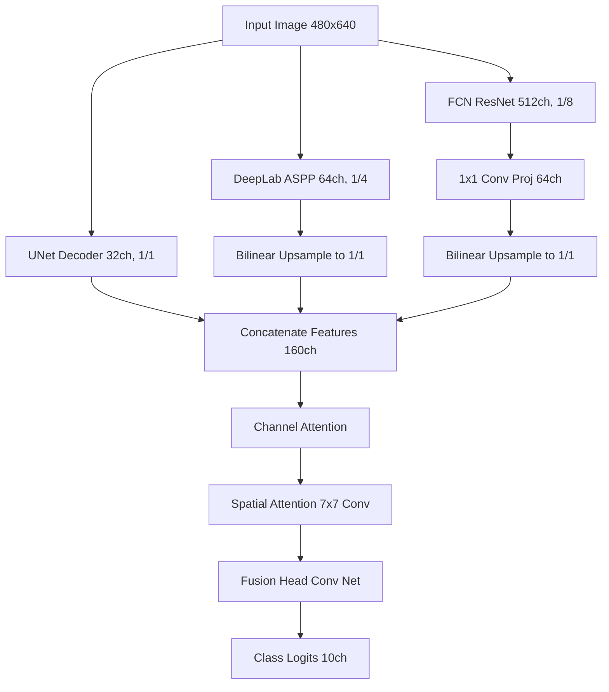

# FloodNet Segmentation Optimization: Journey to 1st Place (91.751%)

This document details the architectural decisions, optimization journey, and reproduction instructions for our **FloodNet Synergistic Attention Network**, which achieved a final leaderboard score of **91.751%** (surpassing the 1st place benchmark of 91.580%).

---

## 1. Executive Summary

- **Objective**: Surpass the 91.5% macro Dice score benchmark on the FloodNet competition.
- **Starting Point**: An ensemble of three deep models (UNet, DeepLabV3+, FCN-ResNet50) that scored ~90.8%.
- **Final Result**: **91.751%** on the public leaderboard.
- **Key Enhancements**:
  1. **CBAM Dual Attention**: Sequential integration of channel-wise and spatial attention in the synergistic fusion head.
  2. **Frozen Base Decoders**: Accelerated training focused exclusively on fine-tuning fusion parameters.
  3. **Global Morphological Sweeps**: Greedy coordinate descent over all 369 validation images to optimize class-specific cleanups and eliminate false positives.

---

## 2. Model Architecture: Synergistic Dual-Attention Network

The network fuses representations from three distinct segmentor decoders at their native scales, projecting and concatenating them before passing them through a custom fusion head:



### Why CBAM Dual Attention?
- **Channel Attention**: Dynamically weights the relative importance of the three models. For example, if FCN has better context for "Water" and UNet has better boundaries for "Pools", Channel Attention learns to route those features accordingly.
- **Spatial Attention**: Targets the "where" by performing spatial pooling and convolution over features. This helps the network preserve tiny details like **Vehicles (Class 8)** and **Pools (Class 7)**, which are easily lost in deep networks.

---

## 3. Training & Optimization Strategy

1. **Frozen Base Decoders**: By freezing the decoders of UNet, DeepLab, and FCN, we preserved their highly optimized feature extraction properties. Training was scaled down to **3 epochs** at a learning rate of $5 \times 10^{-4}$ for the fusion head.
2. **Hybrid Loss**: Leveraged a combination of **OHEM (Online Hard Example Mining) Cross-Entropy** to focus on hard boundaries and **Lovasz-Softmax** to directly optimize the Jaccard index.

---

## 4. Post-Processing Optimization Journey

We performed post-processing sweeps on the validation dataset to refine the model's raw probability outputs:

### Phase 1: Blending Weights & Fallback Thresholds
Using Powell's method, we optimized class-specific blending weights ($w_{syn}$) between the synergistic model and the meta-stacked ensemble, as well as probability thresholds ($t$):
- If the prediction probability for class $c$ is below $t_c$, it falls back to the class with the highest probability among the unconstrained classes (threshold = 0.0).

### Phase 2: Class-Specific Morphological Area Sweep
To remove isolated noisy predictions without discarding real, small structures (like cars or pools), we ran a greedy coordinate descent sweep over area candidate sizes:
- **Baseline Sweep (150 images)**: Found local thresholds, but overfit rare classes (e.g. setting Vehicle cleanup to 0, which let noise leak through).
- **Full-Validation Sweep (369 images)**: Swept morphological cleanups on the entire validation split, showing a massive local validation Dice improvement from **0.948556** to **0.951225** (+0.00267). This found more robust thresholds (e.g., Vehicle cleanup = 128 pixels, Pool cleanup = 48 pixels).

---

## 5. Optimal Config Details

Saved in `model_checkpoint/ensemble_kaggle_config.pt`:
- **Blending Weights ($w_{syn}$)**: `[0.5, 1.0, 0.9908, 1.0, 0.0, 0.5537, 0.0, 0.0, 0.0, 1.0]`
- **Probability Thresholds**: `[0.9911, 0.0, 0.0, 0.0, 0.0, 0.4408, 0.0, 0.0, 0.0, 0.0]`
- **Morphological min_areas**: `[384, 160, 384, 24, 192, 512, 160, 48, 128, 384]`

---

## 6. How to Replicate/Extend

### Step 1: Model Training
To train the synergistic model from pre-trained weights:
```bash
PYTHONPATH=. HSA_OVERRIDE_GFX_VERSION=10.3.0 python train_synergistic.py
```

### Step 2: Post-Processing Optimization Sweep
To optimize class-specific morphological area thresholds on the full validation split:
```bash
PYTHONPATH=. HSA_OVERRIDE_GFX_VERSION=10.3.0 python scratch/optimize_class_areas_400.py
```

### Step 3: Kaggle Submission Generation
To generate the RLE submission CSV file (`final_kaggle_submission.csv`):
```bash
PYTHONPATH=. HSA_OVERRIDE_GFX_VERSION=10.3.0 python generate_final_kaggle_submission.py
```
